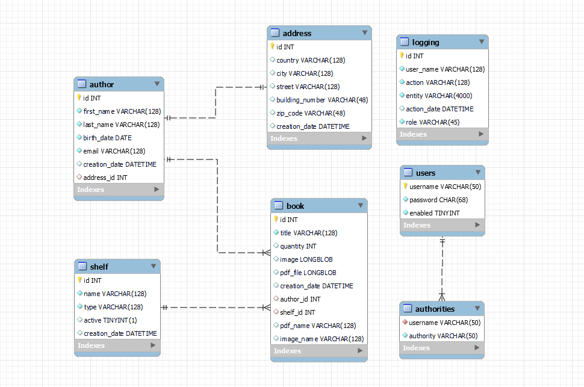

# Library_Project_SpringBoot_and_Thymeleaf(MVC)

## Overview

This project is a web-based library management system developed using Spring Boot and Thymeleaf. It is designed to manage the operations of a library, including book management,  author management, and shelf management.

## Features

- **User Management**: Login, and manage user accounts with different roles (Admin, User).
- **Book Management**: Add, update, delete, and view book details. Also, user can download PDF book file.
- **Author Management**: Add, update, delete, and view author details.
- **Shelf Management**: Add, update, delete, and view shelf details.
- **Security**: Secure access to different parts of the application using Spring Security.
- **AOP**: Logging any addition operation to the database using AOP.
- **Responsive Design**: User-friendly interface designed with Thymeleaf.

## Technologies Used

- **Backend**: Spring Boot
- **Frontend**: Thymeleaf
- **Database**: MySQL
- **Security**: Spring Security
- **Build Tool**: Maven
- **Patterns**: MVC, Repository

## Scrrenshots

### ERD

### Login Page

### Access Denied

### Admin Home Page

### User Home Page

### Book Sample

### Books

### Add Book

### Authors

### Add Author

### Shelves

### Add Shelf

